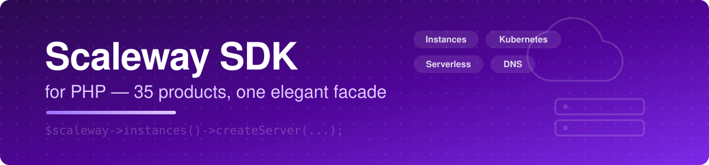

<div align="center">



# ☁️ Scaleway SDK for PHP

**A modern, fully typed PHP SDK for the entire Scaleway API — 35 product modules, one elegant facade.**

[](https://www.php.net/)
[](https://symfony.com/)
[](tests/)
[](#api-reference)
[](LICENSE)

*Instances · Elastic Metal · Kubernetes · Serverless · Databases · DNS · Load Balancers · Secret Manager · and everything in between*

[Installation](#installation) · [Quick Start](#quick-start-plain-php) · [API Reference](#api-reference) · [Error Handling](#error-handling)

</div>

---

```php
$scaleway = new Scaleway(new ScalewayClient(secretKey: getenv('SCW_SECRET_KEY')));

$server = $scaleway->instances()->createServer('web01', 'DEV1-S', 'ubuntu_jammy');
$scaleway->instances()->powerOn($server->data('server')['id']);
$scaleway->dns()->addRecord('example.com', 'www', 'A', '203.0.113.10');
```

Framework-agnostic core — usable from any PHP project, script, or worker — with an optional bundle for first-class Symfony integration. Authenticated with IAM secret keys, zone/region aware, typed exceptions, automatic pagination, and a comment-free, strictly typed codebase (PHP 8.2+, `declare(strict_types=1)` everywhere).

---

## Table of Contents

- [Features](#features)
- [Requirements](#requirements)
- [Installation](#installation)
- [Quick Start (plain PHP)](#quick-start-plain-php)
- [Symfony Integration (optional)](#symfony-integration-optional)
- [Architecture](#architecture)
- [Zones, Regions and Projects](#zones-regions-and-projects)
- [API Reference](#api-reference)
  - [Instances](#instances)
  - [Elastic Metal](#elastic-metal)
  - [Apple Silicon](#apple-silicon)
  - [Block Storage](#block-storage)
  - [VPC & IPAM](#vpc--ipam)
  - [Public Gateways](#public-gateways)
  - [Load Balancers](#load-balancers)
  - [Managed Databases (RDB)](#managed-databases-rdb)
  - [Managed Redis](#managed-redis)
  - [Kubernetes Kapsule](#kubernetes-kapsule)
  - [Container Registry](#container-registry)
  - [Serverless Containers & Functions](#serverless-containers--functions)
  - [Serverless Jobs](#serverless-jobs)
  - [Web Hosting](#web-hosting)
  - [Transactional Email](#transactional-email)
  - [Secret Manager](#secret-manager)
  - [DNS & Domains](#dns--domains)
  - [Account, IAM & Billing](#account-iam--billing)
  - [Instance Scaling Groups](#instance-scaling-groups)
  - [File Storage](#file-storage)
  - [Elastic Metal Flexible IPs](#elastic-metal-flexible-ips)
  - [Edge Services](#edge-services)
  - [Managed MongoDB](#managed-mongodb)
  - [Serverless SQL Databases](#serverless-sql-databases)
  - [Key Manager](#key-manager)
  - [Managed Inference](#managed-inference)
  - [Messaging: NATS, Queues & Topics](#messaging-nats-queues--topics)
  - [IoT Hub](#iot-hub)
  - [Cockpit](#cockpit)
  - [Audit Trail](#audit-trail)
  - [Marketplace](#marketplace)
  - [Coverage notes](#coverage-notes)
- [Responses](#responses)
- [Error Handling](#error-handling)
- [Testing](#testing)
- [Security Notes](#security-notes)
- [License](#license)

---

## Features

| | |
|---|---|
| 🧩 **35 product modules** | One facade covering the whole `api.scaleway.com` surface — every slug and version verified against the official API documentation |
| 🌍 **Zone/region aware** | Configure `default_zone` / `default_region` once; every method accepts a per-call override and the SDK builds the right `/zones/…` or `/regions/…` path |
| 🎯 **Project injection** | Set `default_project_id` once and creation calls fill `project` / `project_id` automatically (explicit values always win) |
| 📦 **Smart responses** | `items()` auto-detects Scaleway's per-product envelope keys, `totalCount()` reads body or `X-Total-Count`, `paginate()` streams all pages through a generator |
| 🚨 **Typed exceptions** | One marker interface, three exception types — catch narrowly or broadly; validation `details` flattened into readable messages |
| 🔓 **Nothing sealed off** | `get`/`post`/`put`/`patch`/`delete` accept any path, so an endpoint not wrapped by a module is one call away |
| 🛠 **Framework-agnostic** | Only hard dependency is `symfony/http-client`; the optional Symfony bundle adds semantic config and autowiring |
| ✅ **Fully unit-tested** | 47 tests against `MockHttpClient` — no network required |

## Requirements

| Dependency | Version |
|---|---|
| PHP | >= 8.2 |
| Scaleway | an IAM API key (secret key) |
| Symfony | 6.4 LTS or 7.x — **optional**, only for the bundle integration |

## Installation

If the package is available on [Packagist](https://packagist.org/packages/chuckbartowski/scaleway-sdk):

```bash
composer require chuckbartowski/scaleway-sdk
```

Otherwise, install it straight from the Git repository — add it as a VCS source in your project's `composer.json`:

```json
{
    "repositories": [
        {
            "type": "vcs",
            "url": "https://github.com/ChuckBartowski11/Scaleway"
        }
    ]
}
```

Then require it:

```bash
composer require chuckbartowski/scaleway-sdk:^1.0
```

## Quick Start (plain PHP)

No framework required — build the client and go:

```php
use ChuckBartowski\ScalewaySdk\Client\ScalewayClient;
use ChuckBartowski\ScalewaySdk\Scaleway;

$scaleway = new Scaleway(new ScalewayClient(
    secretKey: getenv('SCW_SECRET_KEY'),
    defaultProjectId: getenv('SCW_DEFAULT_PROJECT_ID'),
    defaultZone: 'fr-par-1',
    defaultRegion: 'fr-par',
));

$server = $scaleway->instances()->createServer('web01', 'DEV1-S', 'ubuntu_jammy');
$scaleway->instances()->powerOn($server->data('server')['id']);

$scaleway->dns()->addRecord('example.com', 'www', 'A', '203.0.113.10');
```

Client constructor signature:

```php
new ScalewayClient(
    string $secretKey,                        // IAM API key secret
    string $defaultProjectId = '',            // auto-injected into creation calls
    string $defaultZone = 'fr-par-1',
    string $defaultRegion = 'fr-par',
    float $timeout = 30.0,
    ?HttpClientInterface $httpClient = null,  // inject your own (retries, proxy, mock…)
);
```

## Symfony Integration (optional)

Register the bundle:

```php
// config/bundles.php
return [
    ChuckBartowski\ScalewaySdk\ScalewaySdkBundle::class => ['all' => true],
];
```

Then create `config/packages/scaleway_sdk.yaml`:

```yaml
scaleway_sdk:
    secret_key: '%env(SCW_SECRET_KEY)%'
    default_project_id: '%env(SCW_DEFAULT_PROJECT_ID)%'
    default_zone: 'fr-par-1'
    default_region: 'fr-par'
```

### Configuration reference

| Key | Type | Default | Description |
|---|---|---|---|
| `secret_key` | string | *required* | IAM API key secret, sent as `X-Auth-Token` |
| `default_project_id` | string | `''` | Project auto-injected into creation calls |
| `default_zone` | string | `fr-par-1` | Zone for zoned products (Instances, Elastic Metal, LB) |
| `default_region` | string | `fr-par` | Region for regional products (RDB, K8s, VPC, Registry…) |
| `timeout` | float | `30.0` | Per-request timeout in seconds |

The `Scaleway` facade is then autowirable in controllers, services, commands, and message handlers. The bundle reuses your application's `http_client` service when available and falls back to a native client otherwise.

## Architecture

```
src/
├── ScalewaySdkBundle.php        Symfony bundle: config tree + service wiring (optional)
├── Scaleway.php                 Facade: entry point for all modules
├── Client/
│   └── ScalewayClient.php       Transport, X-Auth-Token, JSON handling, defaults
├── Response/
│   └── ApiResponse.php          Immutable normalized response
├── Exception/
│   ├── ScalewaySdkExceptionInterface.php
│   ├── ApiException.php         API answered but reported a failure
│   ├── AuthenticationException.php
│   └── TransportException.php   Network / TLS / timeout / invalid JSON
└── Api/
    ├── AbstractApi.php          zonal()/regional() path builders + project injection
    ├── InstanceApi.php          BareMetalApi.php        AppleSiliconApi.php
    ├── BlockStorageApi.php      VpcApi.php              PublicGatewayApi.php
    ├── IpamApi.php              LoadBalancerApi.php     RdbApi.php
    ├── RedisApi.php             KubernetesApi.php       RegistryApi.php
    ├── ContainerApi.php         FunctionApi.php         WebHostingApi.php
    ├── TransactionalEmailApi.php SecretManagerApi.php   DnsApi.php
    └── AccountApi.php           IamApi.php              BillingApi.php
```

Design decisions:

- **Facade + lazy modules**: `Scaleway` instantiates each module on first use and caches it.
- **Modules always validate**: every module method calls `ensureSuccess()` internally and throws `ApiException` on failure. To inspect a failed response without an exception, drop down to the client level.
- **Per-product versioning is encapsulated**: each module knows its product's API version (`instance/v1`, `vpc/v2`, `domain/v2beta1`…) so callers never touch versioned paths.

## Zones, Regions and Projects

Scaleway splits its catalog between **zoned** products (Instances, Elastic Metal, Load Balancers — `fr-par-1`, `fr-par-2`, `nl-ams-1`, `pl-waw-1`…) and **regional** products (RDB, Kubernetes, VPC, Registry, IPAM — `fr-par`, `nl-ams`, `pl-waw`). The SDK handles both:

```php
$scaleway->instances()->servers();                      // default zone (fr-par-1)
$scaleway->instances()->servers(zone: 'nl-ams-1');      // per-call override
$scaleway->databases()->instances(region: 'pl-waw');    // regional override
```

Most resources belong to a **Project**. Set `default_project_id` once and every creation call injects it (`project` for Instances, `project_id` for the other products); passing it explicitly in `options` always takes precedence.

## API Reference

Every method returns an [`ApiResponse`](#responses) and throws on failure (see [Error Handling](#error-handling)). Zoned methods accept a trailing `?string $zone = null`, regional ones `?string $region = null`.

### Instances

`$scaleway->instances()` — the full `instance/v1` surface.

| Group | Methods |
|---|---|
| Servers | `servers()`, `server(id)`, `createServer(name, commercialType, image, options)`, `updateServer(id, fields)`, `deleteServer(id)` |
| Power | `powerOn`, `powerOff`, `reboot`, `terminate`, `backup(id, ?name)` — or raw `serverAction(id, action, options)` |
| Volumes | `volumes()`, `volume(id)`, `createVolume(name, type, sizeBytes)`, `updateVolume`, `deleteVolume` |
| Snapshots | `snapshots()`, `createSnapshot(volumeId, name)`, `deleteSnapshot(id)` |
| Images | `images()`, `createImage(name, rootVolumeId)`, `deleteImage(id)` |
| Flexible IPs | `ips()`, `createIp()`, `attachIp(ipId, serverId)`, `detachIp(ipId)`, `deleteIp(id)` |
| Security groups | `securityGroups()`, `createSecurityGroup(name)`, `securityGroupRules(id)`, `createSecurityGroupRule(id, rule)` |
| Private NICs | `privateNics(serverId)`, `createPrivateNic(serverId, privateNetworkId)`, `deletePrivateNic(...)` |

Power actions return a `task` — poll `server(id)` until the state settles. Volume sizes are in **bytes** (`50_000_000_000` for 50 GB).

### Elastic Metal

`$scaleway->bareMetal()` — `baremetal/v1`: `servers()`, `createServer(offerId, name)`, `install(id, osId, hostname, sshKeyIds)`, `start`/`stop`/`reboot(id, bootType)`, `metrics(id)`, `offers()`, `oses()`, `updateIp(serverId, ipId, fields)` (reverse DNS).

### Apple Silicon

`$scaleway->appleSilicon()` — `apple-silicon/v1alpha1` (zoned, `fr-par-3`): `servers()`, `createServer(type, ?name)` (types: `M1-M`, `M2-M`, `M2-L`…), `deleteServer`, `rebootServer`, `reinstallServer`, `serverTypes()`. Mind the 24-hour minimum allocation period enforced by Apple's licensing.

### Block Storage

`$scaleway->blockStorage()` — `block/v1alpha1` (SBS, the low-latency block storage that replaces Instance `b_ssd` volumes): `volumes()`, `createVolume(name, sizeBytes, ?perfIops)` (5000 or 15000 IOPS), `createVolumeFromSnapshot(name, snapshotId)`, `updateVolume` (resize, IOPS change), `deleteVolume`, `snapshots()`, `createSnapshot(volumeId, name)`, `deleteSnapshot`.

### VPC & IPAM

`$scaleway->vpc()` — `vpc/v2`: `vpcs()`, `createVpc(name)`, `privateNetworks()`, `createPrivateNetwork(name)`, `updatePrivateNetwork`, `deletePrivateNetwork`.
`$scaleway->ipam()` — `ipam/v1`: `ips(query)` (filter by resource, private network…), `bookIp(source, options)`, `updateIp`, `releaseIp`.

### Public Gateways

`$scaleway->publicGateways()` — `vpc-gw/v2` (zoned): `gateways()`, `createGateway(type)` (`VPC-GW-S`…), `updateGateway`, `deleteGateway(id, deleteIp)`, `attachNetwork(gatewayId, privateNetworkId)` / `detachNetwork(gatewayNetworkId)`, and NAT: `patRules(query)`, `createPatRule(gatewayId, publicPort, privateIp, privatePort, protocol)`, `deletePatRule`.

```php
$scaleway->publicGateways()->createPatRule('gw-uuid', 2222, '192.168.1.10', 22, 'tcp');
```

### Load Balancers

`$scaleway->loadBalancers()` — `lb/v1` (zoned): `loadBalancers()`, `createLoadBalancer(name)`, `deleteLoadBalancer(id, releaseIp)`, backends (`createBackend(lbId, name, protocol, port)`, `setBackendServers(backendId, ips)`), frontends (`createFrontend(lbId, name, inboundPort, backendId)`), certificates (`createCertificate(lbId, name, options)` — Let's Encrypt or custom).

### Managed Databases (RDB)

`$scaleway->databases()` — `rdb/v1`: `instances()`, `createInstance(name, engine, nodeType, userName, password)` (engine e.g. `PostgreSQL-15`), `databases(instanceId)`, `createDatabase`, `users(instanceId)`, `createUser(instanceId, name, password, admin)`, `setPrivilege(instanceId, db, user, permission)` (`readonly`, `readwrite`, `all`, `custom`, `none`), `backups()`, `createBackup`, `restoreBackup`.

### Managed Redis

`$scaleway->redis()` — `redis/v1` (zoned): `clusters()`, `createCluster(name, version, nodeType, userName, password)` (node types `RED1-MICRO`…), `updateCluster`, `migrateCluster(id, fields)` (version or node-type migration), `deleteCluster`, ACLs (`addAclRules(clusterId, rules)`, `deleteAclRule(aclId)`).

### Kubernetes Kapsule

`$scaleway->kubernetes()` — `k8s/v1`: `clusters()`, `createCluster(name, version, cni, pools)`, `upgradeCluster(id, version)`, `deleteCluster(id, withAdditionalResources)`, `kubeconfig(clusterId)`, pools (`createPool(clusterId, name, nodeType, size)`, `updatePool` for autoscaling), nodes (`nodes(clusterId)`, `replaceNode`, `rebootNode`), `versions()`.

### Container Registry

`$scaleway->registry()` — `registry/v1`: `namespaces()`, `createNamespace(name, isPublic)`, `deleteNamespace`, `images()`, `deleteImage`, `tags(imageId)`, `deleteTag`.

### Serverless Containers & Functions

`$scaleway->containers()` — `containers/v1beta1` (regional): `namespaces()`, `createNamespace(name)`, `containers()`, `createContainer(namespaceId, name, registryImage)`, `updateContainer`, `deployContainer(id)`, `deleteContainer`, custom `domains()` / `createDomain(containerId, hostname)`.
`$scaleway->functions()` — `functions/v1beta1` (regional): same shape with `createFunction(namespaceId, name, runtime)`, `uploadUrl(functionId, contentLength)` (presigned zip upload), `deployFunction(id)`, `runtimes()`.

The create → upload/configure → **deploy** cycle matters: configuration changes only go live after an explicit deploy.

### Web Hosting

`$scaleway->webHosting()` — `webhosting/v1` (regional, Scaleway's managed cPanel offering): `hostings()`, `createHosting(offerId, domain, email)`, `updateHosting`, `deleteHosting`, `offers()`, `controlPanels()`.

### Transactional Email

`$scaleway->transactionalEmail()` — `tem/v1alpha1` (regional): sender domains (`domains()`, `createDomain(domainName)`, `checkDomain(id)` for SPF/DKIM validation, `revokeDomain`) and sending (`sendEmail(fromEmail, to, subject, text, html)`, `emails(query)`, `email(id)`, `cancelEmail(id)`).

```php
$scaleway->transactionalEmail()->sendEmail('noreply@example.com', ['user@example.com'], 'Welcome', 'Hello!');
```

### Secret Manager

`$scaleway->secrets()` — `secret-manager/v1beta1` (regional): `secrets()`, `createSecret(name)`, `deleteSecret`, versions (`versions(secretId)`, `createVersion(secretId, plaintext)` — base64 encoding handled for you, `accessVersion(secretId, revision)` defaulting to `latest`, `enableVersion` / `disableVersion`).

### DNS & Domains

`$scaleway->dns()` — `domain/v2beta1` (global, the zone is the domain name). Registrar side: `domains(query)` and `domain(name)` list the domain names attached to the account. Zone side:

| Method | Notes |
|---|---|
| `zones(query)` / `createZone(domain, subdomain)` / `deleteZone(zone)` | |
| `records(zone, query)` | filter with `['type' => 'A', 'name' => 'www']` |
| `addRecord(zone, name, type, data, ttl)` | wraps the changes payload for you |
| `deleteRecord(zone, name, type, ?data)` | omit `data` to delete all records of that name/type |
| `updateRecords(zone, changes)` | raw access to the full changes API (add/set/delete/clear) |
| `exportZone(zone)` / `refreshZone(zone)` | BIND export / force refresh |

### Account, IAM & Billing

`$scaleway->account()` — `account/v3`: `projects()`, `createProject(name)`, `updateProject`, `deleteProject`.
`$scaleway->iam()` — `iam/v1alpha1`: `apiKeys()`, `createApiKey()`, `deleteApiKey(accessKey)`, `sshKeys()`, `createSshKey(name, publicKey)`, `users()`, `applications()`, `createApplication(name)`, `policies()`, `createPolicy(name, rules)`.
`$scaleway->billing()` — `billing/v2beta1`: `consumptions()`, `invoices()`, `downloadInvoice(id)`, `discounts()`.

### Serverless Jobs

`$scaleway->jobs()` — `serverless-jobs/v1alpha2` (regional): job definitions CRUD (`createDefinition(name, imageUri)` with cron, resources and env in options), `run(definitionId)`, `runs()` / `runDetails(runId)`, `stopRun(runId)`.

```php
$definition = $scaleway->jobs()->createDefinition('nightly-report', 'rg.fr-par.scw.cloud/ns/report:latest');
$scaleway->jobs()->run($definition->data('id'));
```

### Instance Scaling Groups

`$scaleway->autoscaling()` — `autoscaling/v1alpha1` (zonal): `instanceGroups()` CRUD with `capacity` (min/max size, cooldown), `templates()` (`createTemplate(name, commercialType)` with volumes and tags), `policies()` (`createPolicy(groupId, name, action, type)` — scale up/down on metric or schedule), `instanceGroupEvents(id)` for the scaling history.

### File Storage

`$scaleway->fileStorage()` — `file/v1alpha1` (regional): shared NFS-style filesystems attachable to Instances through Private Networks — `filesystems()` CRUD (`createFilesystem(name, sizeBytes)`), `attachments()`, `filesystemTypes()`.

### Elastic Metal Flexible IPs

`$scaleway->flexibleIps()` — `flexible-ip/v1alpha1` (zonal): failover IPs for Elastic Metal — `ips()` CRUD, `attachToServer(ipId, serverId)` / `detachFromServer(ipId)`, virtual MACs (`generateMac(ipId, macType)`, `deleteMac`) for virtualization setups.

### Edge Services

`$scaleway->edgeServices()` — `edge-services/v1beta1` (global): the CDN/WAF layer in front of Object Storage buckets and Load Balancers — `pipelines()` CRUD, per-pipeline stages (`createBackendStage`, `createCacheStage`, `createTlsStage`, `createDnsStage`), `plans()`, and cache purging (`createPurgeRequest(pipelineId, ?assets)` — omit `assets` to purge everything).

### Managed MongoDB

`$scaleway->mongodb()` — `mongodb/v1` (regional): `instances()` CRUD (`createInstance(name, version, nodeType, nodeNumber, userName, password, volume)`), `upgradeInstance`, TLS `certificate(instanceId)`, snapshots (`createSnapshot`, `restoreSnapshot`), `users()` management, `databases()`, public/private `createEndpoint` / `deleteEndpoint`, plus the `nodeTypes()` and `versions()` catalogs.

### Serverless SQL Databases

`$scaleway->serverlessSql()` — `serverless-sqldb/v1alpha1` (regional): autoscaling PostgreSQL billed to the query — `databases()` CRUD with `cpu_min`/`cpu_max` bounds, `restoreDatabase(id, backupId)`, `backups(databaseId)`, `exportBackup`.

### Key Manager

`$scaleway->keyManager()` — `key-manager/v1alpha1` (regional): Scaleway's KMS — `keys()` CRUD, `encrypt(keyId, plaintext)` / `decrypt(keyId, ciphertext)` (base64 handled for you), envelope encryption via `generateDataKey`, `rotateKey`, asymmetric `sign`/`verify`, `publicKey(id)`, `enableKey`/`disableKey`.

```php
$encrypted = $scaleway->keyManager()->encrypt('key-uuid', 'sensitive payload');
```

### Managed Inference

`$scaleway->inference()` — `inference/v1` (regional): dedicated LLM deployments — `deployments()` CRUD (`createDeployment(name, modelId, nodeTypeName, endpoints)`), `models()` catalog + `importModel(source)` from Hugging Face or object storage, `nodeTypes()` (GPU offers), endpoint management with public or Private Network exposure.

### Messaging: NATS, Queues & Topics

`$scaleway->messaging()` — `mnq/v1beta1` (regional), the management plane for the three messaging products: NATS (`natsAccounts()`, `createNatsAccount`, `natsCredentials`, `createNatsCredentials`), Queues/SQS (`activateQueues()`, `queuesInfo()`, `createQueuesCredentials(name, permissions)`, `deactivateQueues()`), Topics/SNS (`activateTopics()`, `topicsInfo()`, `createTopicsCredentials`). The data planes speak native NATS/SQS/SNS protocols — use the matching client libraries with these credentials.

### IoT Hub

`$scaleway->iot()` — `iot/v1` (regional): MQTT hubs (`hubs()` CRUD, `enableHub`/`disableHub`, `hubMetrics`), devices (`createDevice(hubId, name)`, certificates via `deviceCertificate` / `renewDeviceCertificate`, enable/disable), message `routes()` (to databases, S3, functions…) and external `networks()`.

### Cockpit

`$scaleway->cockpit()` — `cockpit/v1` (global): the observability stack — Grafana users (`grafanaUsers()`, `createGrafanaUser(login, role)`, `deleteGrafanaUser`), prebuilt `productDashboards()`, and `syncDatasources()` to refresh data sources after enabling new products.

### Audit Trail

`$scaleway->auditTrail()` — `audit-trail/v1alpha1` (regional): who did what, when — `events()` (resource events, filterable by product/verb/date), `authenticationEvents()`, `systemEvents()`, `products()` (which products are integrated), and export jobs to Object Storage (`createExport`, `deleteExport`).

### Marketplace

`$scaleway->marketplace()` — `marketplace/v2` (global, no authentication required): the public image catalog — `images()`, `image(id)`, `imageVersions(imageId)`, `localImages()` (per-zone IDs to feed `instances()->createServer()`), `categories()`.

### Coverage notes

- The Instances module also exposes the catalog (`serverTypes()`, `serverTypesAvailability()`) and `placementGroups()` / `createPlacementGroup(name, policyMode, policyType)`; Transactional Email includes webhooks, blocklists and project settings; Web Hosting includes `backups()` / `restoreBackup()`.
- Two path quirks verified against the official docs: Block Storage uses `block/v1` with a **singular** `/zone/{zone}/` segment, and Transactional Email's slug is `transactional-email` (not `tem`).
- Intentionally out of scope: **Object Storage** (S3 protocol — use any S3 client), the **data planes** of NATS/Queues/Topics (native NATS/SQS/SNS protocols — only their management API is wrapped), **Dedibox**, and beta data products (Kafka, Data Warehouse, Data Lab, OpenSearch, RabbitMQ). Any `api.scaleway.com` endpoint remains reachable through the client's generic `get`/`post`/`patch`/`delete` methods.
- Products still in `alpha`/`beta` at Scaleway may change paths on GA — each module encapsulates its version so an SDK update is a one-line change.

## Responses

All calls return an immutable `ApiResponse`. Scaleway wraps every list under a product-specific key — here is what actually comes back from `GET /instance/v1/zones/fr-par-1/servers`:

```json
{
    "servers": [
        {
            "id": "d67f36bc-…",
            "name": "web01",
            "commercial_type": "DEV1-S",
            "state": "running",
            "public_ip": { "address": "203.0.113.10" },
            "zone": "fr-par-1"
        }
    ],
    "total_count": 1
}
```

The response object gives you three levels of access — raw, keyed, and list-aware:

```php
$response = $scaleway->instances()->servers();

$response->success;              // bool
$response->statusCode;           // int
$response->data;                 // the decoded JSON body above (null on 204)
$response->data('servers');      // keyed access with optional default
$response->errors;               // list<string>
$response->raw;                  // complete decoded payload
$response->headers;              // response headers (lowercased keys)

$response->items();              // the wrapped list, envelope key auto-detected
$response->items('servers');     // or with an explicit key
$response->first();              // first item, null when the list is empty
$response->totalCount();         // body total_count, falls back to X-Total-Count header
$response->header('x-total-count');
```

`items()` works across every module without configuration: it finds the single list key in the payload (`servers`, `clusters`, `secrets`, `records`…), so switching products never changes your consuming code.

### Pagination

List endpoints are paginated (`page` + `page_size`, or `per_page` for the Instance API; 100 items max per page). The client can walk all pages for you and stream items through a generator — memory-friendly even on large fleets:

```php
foreach ($scaleway->client()->paginate('/instance/v1/zones/fr-par-1/servers', itemsKey: 'servers', perPageParam: 'per_page') as $server) {
    echo $server['name'], PHP_EOL;
}

foreach ($scaleway->client()->paginate('/k8s/v1/regions/fr-par/clusters') as $cluster) {
    // regional products use the default page_size parameter, envelope key auto-detected
}
```

## Error Handling

All SDK exceptions implement `ScalewaySdkExceptionInterface`, so a single catch covers everything:

| Exception | Thrown when | Extras |
|---|---|---|
| `ApiException` | The API answered but reported a failure (module methods validate automatically) | `getErrors()`, `getStatusCode()`, `getRaw()` |
| `AuthenticationException` | The secret key is missing or the API answered HTTP 401 | thrown *before* any request when the key is empty |
| `TransportException` | Network error, TLS failure, timeout, or a non-JSON response body | wraps the underlying `symfony/http-client` exception |

Validation failures are readable out of the box — `message`, `type`, and each `details` entry are flattened into `getErrors()`:

```
invalid_arguments: invalid argument(s)
commercial_type: unknown commercial type
```

To inspect a failed response without exceptions, use the client directly — client-level methods return the response as-is.

## Testing

The suite runs entirely offline against `MockHttpClient`:

```bash
composer install
vendor/bin/phpunit
```

To test your own services, inject a `ScalewayClient` built with a mock:

```php
use ChuckBartowski\ScalewaySdk\Client\ScalewayClient;
use ChuckBartowski\ScalewaySdk\Scaleway;
use Symfony\Component\HttpClient\MockHttpClient;
use Symfony\Component\HttpClient\Response\JsonMockResponse;

$http = new MockHttpClient(new JsonMockResponse(['servers' => []]));
$scaleway = new Scaleway(new ScalewayClient('key', httpClient: $http));
```

## Security Notes

- The secret key is passed with `#[\SensitiveParameter]`, so it never appears in stack traces.
- Scope IAM API keys with policies (`createPolicy()`) instead of using an Owner key everywhere — one application per service, least privilege per policy rule.
- Keep credentials in `.env.local` or your secret vault — never commit them.
- Object Storage is intentionally out of scope: it speaks the S3 protocol on separate endpoints — use any S3 client with your Scaleway credentials.
- `terminate` on an Instance deletes the server **and its local volumes**; `deleteCluster(withAdditionalResources: true)` deletes load balancers and volumes created by the cluster — gate destructive calls behind confirmation flows in your application.

## License

MIT
